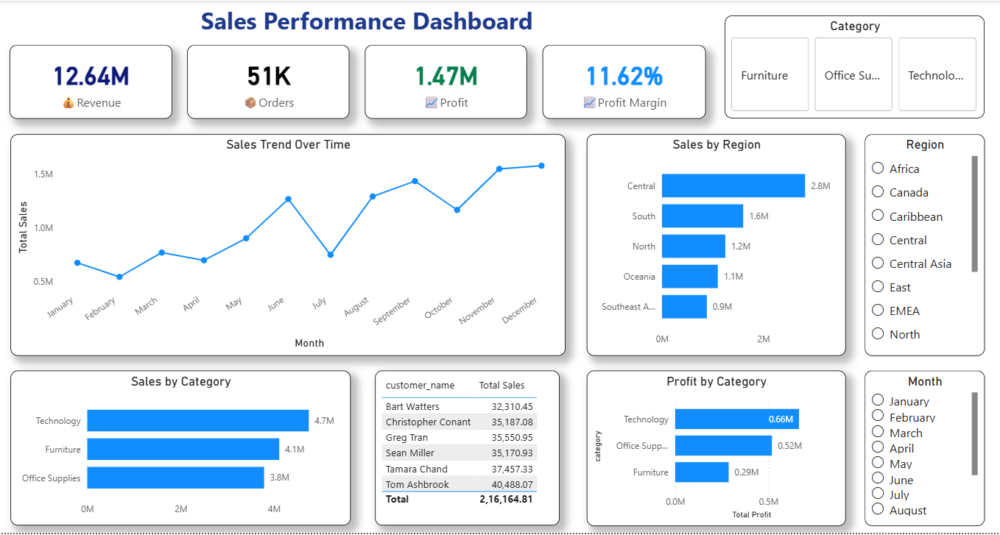

# Sales Performance Dashboard - Power BI

## Project Overview
This project is an interactive Sales Performance Dashboard built using Power BI to analyze revenue, profit, orders, and regional sales performance.

## Key Features
- Revenue, Profit, and Profit Margin KPIs
- Sales Trend Analysis
- Region-wise Sales Comparison
- Category-wise Profit Analysis
- Interactive Filters and Slicers

## Tools Used
- Power BI
- Excel
- DAX
- Data Visualization

## Dataset
Superstore Sales Dataset

## Dashboard Preview

## Insights
- Technology category generated highest sales
- Central region contributed maximum revenue
- Profit margin reached 11.62%

## Files Included
- `.pbix` Power BI file
- Excel dataset
- Dashboard screenshot

## Author
Abhijith S M
